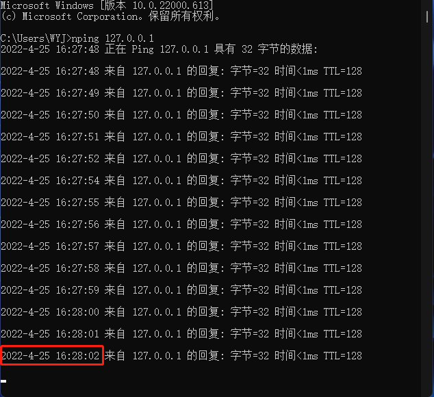
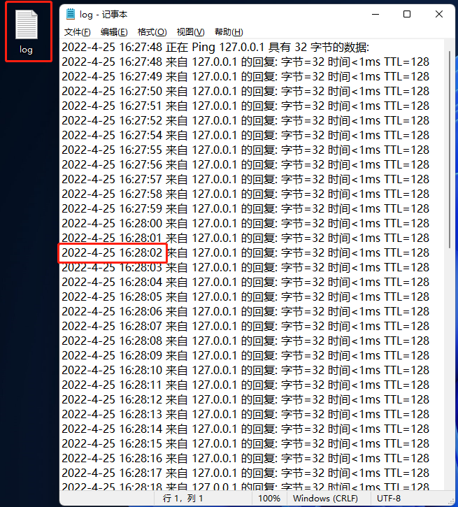

# Node_Ping

## 部署

下载项目依赖

```
npm i
```

## 安装

添加命令到全局`npm`包，在项目根目录下使用以下命令

```bash
npm link
```

## 卸载

从全局`npm`包中删除命令，控制台中输入以下命令

```bash
npm unlink node_ping --global
```

## 使用

```bash
nping ip地址/域名
```

## 说明

本项目作用与常规`ping`命令一样，但本项目只有长`ping`模式，同时每条`ping`记录控制台输出时有时间戳，使用`nping`命令后，桌面会生成`log.txt`文件对此次ping操作进行日志记录。

## 截图





## 备注

本项目基于node环境运行，如没有请先安装[node](https://nodejs.org/en/)

